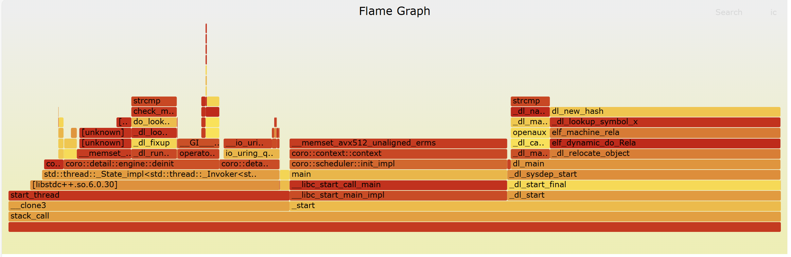

# 性能分析profile教程

tinycoro预置了使用perf一键生成火焰图的脚本`perf_svg.py`，本节教大家如何使用。

### 安装perf

对于linux系统，一般直接运行下列指令即可安装perf

```shell
sudo apt install linux-tools-generic
```

检查perf安装是否成功

```shell
perf -v
```

对于wsl，运行上述安装指令后运行perf系统会出现找不到命令的问题，此时用户用下列指令查找perf路径

```shell
find /usr/lib -name perf
```

将查找到的perf二进制文件拷贝到`/usr/bin`下面就可以正常使用perf了

### 火焰图生成脚本使用

> 💡**什么是火焰图以及为啥能用来分析程序性能呢？**
> 核心的性能分析功能当然是由perf来完成的，当使用perf分析某个程序时，perf会借助系统中断机制对程序的执行过程进行采样，每次采样会记录程序的调用栈，例如每秒采样1000次，如果当前执行程序在某次采样中正在执行函数A，那么可以近似理解为函数A的耗时增加1ms（1s/采样频率），这样对程序的完整执行过程（也支持以attach的形式进行部分采样）进行采样可以得到程序各个函数的具体耗时，此时不难发现perf的性能分析结果是一种近似结果，当采样频率越高结果越精准，但采样频率受到linux系统参数和硬件的限制，并不是随便增加的。
>
> perf并不会直接输出火焰图，而是一份原始数据文件，使用第三方库[FlameGraph](https://github.com/brendangregg/FlameGraph.git)可以将其转换成svg格式易于用户查看，因形状酷似火焰得名火焰图。

在tinycoro项目的`scripts`文件夹下的`perf_svg.py`即生成脚本，比如用户对`./build/bin/hello`这个二进制文件进行性能分析，可以在项目根目录下执行下列指令

```shell
python ./scripts/perf_svg.py ./build/bin/hello
```

运行成功的话svg文件默认会存储在tinycoro项目的`temp`目录下

使用浏览器打开svg文件可查看火焰图，效果如下：


